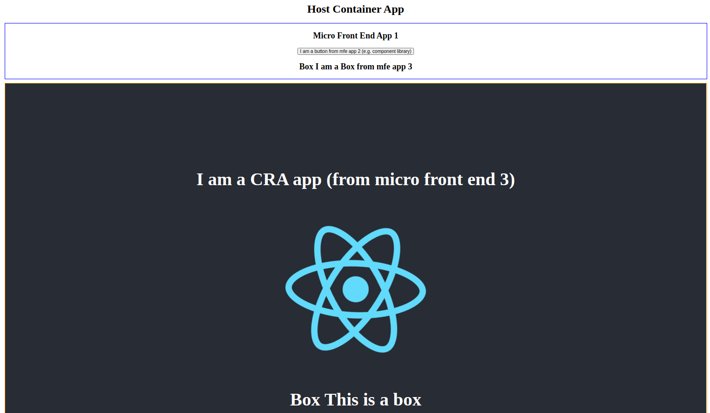

# React Apps with Module Federation Example
## Stitching different React Apps/Components from different servers together!

Example and POC of module federation with react

# Experiment and POC
I followed and modified the below tutorials and information.

https://medium.com/nerd-for-tech/micro-front-ends-hands-on-project-63bd3327e162

https://www.youtube.com/watch?v=D3XYAx30CNc

https://github.com/jherr/wp5-intro-video-code

https://www.youtube.com/watch?v=TOb1c39m64A for webpack 5 setup for further details.

I experimented to see if I can create a federation of cascading apps.
i.e. Container App contains child app which also cointains child components from another app (e.g. component library app)

**Answer is YES. It worked.**

To run the apps, in each folder in packages,
1. `yarn install`
2. `yarn run webpack`

localhost:8080 is the container/host app.

## Findings
### Advantages
- Changes in a child app gets reflected in the parent app very quickly when page is refreshed.
- It is now possible to have separate component libraries live.  All the hosts apps can use latest components/updated at once.

### Disadvantages
- When child app components are updated, I suppose I have to refresh the page of host/parent app. But, this will be minimum if most development is done in child app.
- If child apps go down, all the host apps will be down or affected too, thus kind of double edge sword.  But, I think the positive overweighs the negative.
  
  => **Solution: Actually you can handle mfe import error with React.lazy loading, react.suspense and an ErrorBoundary component. See the example of MFEApp1 in the Host App.js (https://github.com/nfabacus/module-federation-example/blob/main/packages/container/src/App.js).**
  
- Cannot take advantage of Create React App with pre-configration unless eject.
  No point of using Create React App if I just follow the above tutorial/guide, as I have to create a new webpack anyway.

### Other Observations
- bootstrap.js is required when importing external apps.
- React and React dom must be set as singleton in webpack configs for the micro front end apps that are using react hooks (example apps here are `container` and `micro-front-end-1`).
### Futher Investigations To Do
- Investigate if there is any way to use module federation with Create React App without ejecting
  I may try this https://dev.to/kildareflare/how-to-modify-config-of-create-react-app-without-ejecting-5cbn
  
  => After all, I have created a separate webpack.config.js in micro-front-end-3 folder. But, this means it still requires separate webpack configuration.
  
- Try with Storybook
  
  => I have now created cra-with-story book folder.  It works with my own webpack.config.js.
     
     However, `storybook-webpack-federation-plugin` did not work for some reason, and also unfortunately `storybook with webpack5` (https://storybook.js.org/blog/storybook-for-webpack-5/) also did not work as of today 6 June, 2021.

- Try with Next.js

### Another Tech Used
yarn workspace - to keep all the apps in one mono repo:
https://classic.yarnpkg.com/en/docs/workspaces/

- Next, I will try Lerna.

### Use of Mock Service Worker For Development (Browser)
I managed to implement mock service worker.  This repo is an example.
- Check container and micro-front-end-1 for examples.
- Follow MSW (Mock Service Worker) Instruction: https://mswjs.io/docs/getting-started
- Setup and initiate msw in the host app (container)
- `worker.start()` is in `bootstrap.js` in the container app.
- `mocks` folder is also in the container app.

   Add endpoints that you want to intercept and mock in `handlers.js`.

- Already done here, so no need to do it again, but for setting up from scratch, I ran `npx msw init ./ --save` in the root of the host app (container). Note that the directory of installation is root - mockServiceWorker.js should be in the same location as the index.html (its location is specified in webpack config).
- For unit tests, I did not implement here, but msw should be installed in each app with `node` option.